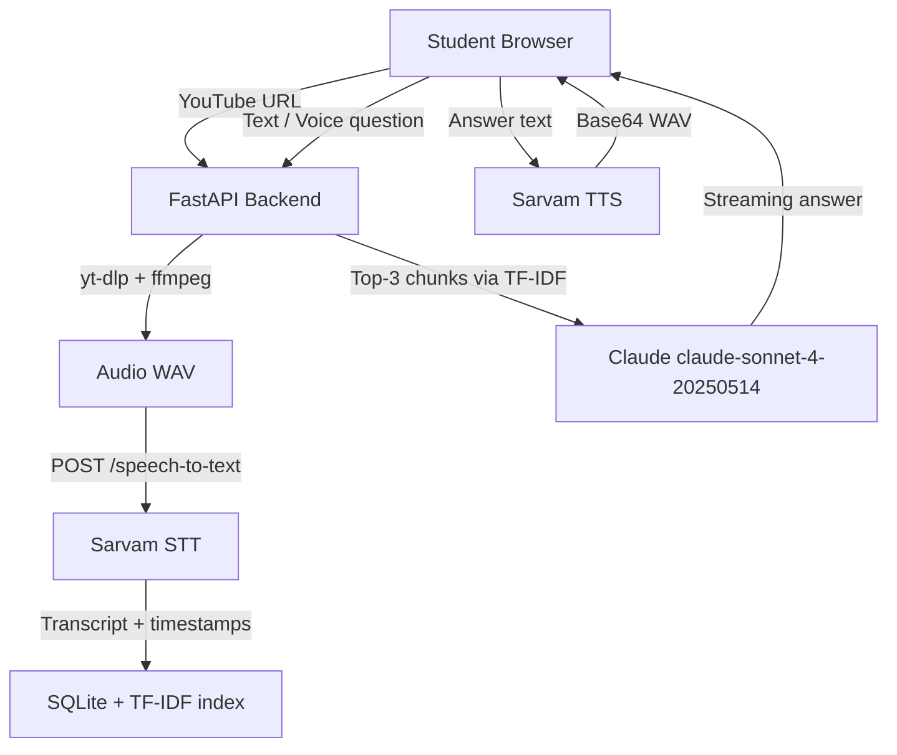

# AI Office Hours | AI ऑफिस आवर्स

A video tutor bot for Indian public schools. Teachers upload a lesson video; students ask questions about it in voice or text (English or Hindi) and receive timestamped, tutor-style answers.

## Architecture



## Features

- **Video ingestion** — paste a YouTube URL, audio is extracted with yt-dlp and transcribed by Sarvam AI
- **Multilingual Q&A** — ask in Hindi or English; Claude answers in the same language with timestamp citations
- **Voice mode** — click the mic, speak your question, hear the answer read aloud
- **Timestamp badges** — `[2:30–3:15]` references in answers become clickable orange chips that seek the video
- **Streaming responses** — answers stream word-by-word via SSE
- **Persistent cache** — transcripts are stored in SQLite so the same video isn't transcribed twice

## Local Setup

### Prerequisites

- Python 3.11+
- Node.js 18+
- `ffmpeg` and `yt-dlp` on your PATH

```bash
# Install ffmpeg (Ubuntu/Debian)
sudo apt install ffmpeg

# Install yt-dlp
pip install yt-dlp
# or: brew install yt-dlp (macOS)
```

### Backend

```bash
cd backend
python -m venv .venv
source .venv/bin/activate        # Windows: .venv\Scripts\activate
pip install -r requirements.txt

# Copy and fill in your keys
cp ../.env.example .env
# Edit .env with your SARVAM_API_KEY and ANTHROPIC_API_KEY

uvicorn main:app --reload --port 8000
```

### Frontend

```bash
cd frontend
npm install

# Set the backend URL (defaults to http://localhost:8000)
echo "VITE_API_URL=http://localhost:8000" > .env

npm run dev
# Open http://localhost:5173
```

### Docker (backend only)

```bash
cp .env.example .env   # fill in keys
docker compose up --build
```

## Deployment

### Backend → Railway

1. Push repo to GitHub
2. New Railway project → "Deploy from GitHub repo"
3. Set root to `/` and point to `railway.json`
4. Add env vars: `SARVAM_API_KEY`, `ANTHROPIC_API_KEY`
5. Note the deployed URL (e.g. `https://ai-office-hours.up.railway.app`)

### Frontend → Vercel

1. Import repo in Vercel
2. Set **Build Command**: `cd frontend && npm install && npm run build`
3. Set **Output Directory**: `frontend/dist`
4. Add env var: `VITE_API_URL=https://<your-railway-url>`
5. Deploy

**Live demo**: _add your deployed URL here_

## API Keys Required

| Key | Where to get |
|-----|-------------|
| `SARVAM_API_KEY` | [console.sarvam.ai](https://console.sarvam.ai) |
| `ANTHROPIC_API_KEY` | [console.anthropic.com](https://console.anthropic.com) |

## API Routes

| Method | Path | Description |
|--------|------|-------------|
| `POST` | `/api/load-video` | Download YouTube audio, transcribe, store chunks |
| `POST` | `/api/ask` | TF-IDF retrieval + Claude streaming answer (SSE) |
| `POST` | `/api/transcribe-question` | Sarvam STT for student voice question |
| `POST` | `/api/speak-answer` | Sarvam TTS for answer audio |
| `GET` | `/health` | Health check |

## Success Criteria

- Paste NCERT YouTube URL → transcript appears in ~30 s
- Click mic, ask "photosynthesis kya hota hai?" → Hindi answer with timestamp → audio plays
- Click timestamp badge → video seeks to that moment
- Same question in English → English answer
- Question not in video → "I don't see this covered in the video"
